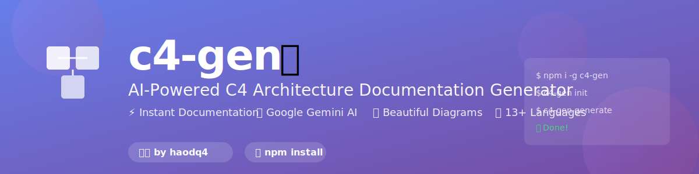

# c4-gen 🚀

<div align="center">



**Created by [Hao Duong (haodq4)](https://github.com/haodq4)**

[](https://github.com/haodq4)
[](https://www.linkedin.com/in/haodq)
[](mailto:haodq4@gmail.com)
[](https://www.npmjs.com/~haodq4)

---

</div>

> **Automatically generate C4 Model architecture documentation from source code using AI**

[](https://www.npmjs.com/package/c4-gen)
[](https://www.npmjs.com/package/c4-gen)
[](https://opensource.org/licenses/MIT)
[](https://nodejs.org)
[](https://github.com/haodq4/c4-gen/stargazers)

[English](#) | [Tiếng Việt](./README.vi.md)

Generate comprehensive architecture documentation in seconds, not hours. Let AI read your code and create beautiful C4 Model diagrams and markdown documentation.

## ✨ Features

- 🤖 **AI-Powered**: Uses Google Gemini AI for intelligent code analysis
- 📊 **Complete C4 Model**: Generates all 4 levels (Context, Container, Component, Code)
- 📝 **Beautiful Output**: Markdown documentation with interactive Mermaid diagrams
- � **Multi-Language**: Supports 13+ programming languages
- ⚡ **CLI Tool**: Simple command-line interface
- 🔧 **Flexible**: Configurable levels, paths, and API keys
- 🆓 **Free & Open Source**: MIT License

## 📦 Cài Đặt

### Global Installation (Khuyến nghị)

```bash
npm install -g c4-gen
```

### Local Installation

```bash
npm install c4-gen
```

## 🔑 Lấy API Key

1. Truy cập [Google AI Studio](https://makersuite.google.com/app/apikey)
2. Đăng nhập bằng Google Account
3. Click "Create API Key"
4. Copy API key

## 🚀 Sử Dụng

### 1. Cấu hình API Key (chỉ cần làm 1 lần)

```bash
c4-gen init -k YOUR_GEMINI_API_KEY
```

### 2. Generate tài liệu cho project

```bash
# Generate tài liệu cho thư mục hiện tại
c4-gen generate

# Generate với path cụ thể
c4-gen generate -p /path/to/your/project

# Generate với output folder tùy chỉnh
c4-gen generate -o ./my-docs

# Generate với level cụ thể (1-4)
c4-gen generate -l 2  # Chỉ sinh Context và Container diagram

# Sử dụng API key khác không lưu vào config
c4-gen generate -k ANOTHER_API_KEY
```

### 3. Xem cấu hình hiện tại

```bash
c4-gen config
```

## 📚 Ví Dụ

### Ví dụ 1: Generate cho Node.js project

```bash
cd my-nodejs-app
c4-gen generate -o ./docs
```

### Ví dụ 2: Generate cho Python project

```bash
c4-gen generate -p /home/user/my-python-app -o ./architecture-docs
```

### Ví dụ 3: Generate full documentation (4 levels)

```bash
c4-gen generate -l 4 -o ./full-docs
```

## 📖 Output Structure

Sau khi chạy, bạn sẽ có cấu trúc như sau:

```
docs/
├── README.md                    # Tổng quan
├── 01-context-diagram.md        # Level 1: Context
├── 02-container-diagram.md      # Level 2: Container
├── 03-component-diagram.md      # Level 3: Component
├── 04-code-diagram.md           # Level 4: Code
└── diagrams/
    └── README.md                # Hướng dẫn về Mermaid diagrams
```

## 🎯 C4 Model Levels

| Level | Tên | Mô Tả | Use Case |
|-------|-----|-------|----------|
| 1 | Context | Hệ thống trong bối cảnh | Hiểu tổng quan hệ thống, người dùng, và hệ thống bên ngoài |
| 2 | Container | Các thành phần chính | Hiểu cấu trúc high-level: web app, API, database, etc. |
| 3 | Component | Các module/component | Hiểu cấu trúc bên trong mỗi container |
| 4 | Code | Chi tiết code | Hiểu implementation: classes, methods, relationships |

## 🛠️ Options

### Command: `init`

Khởi tạo cấu hình API key

```bash
c4-gen init -k <api-key>
```

### Command: `generate`

Sinh tài liệu C4 Model

| Option | Short | Description | Default |
|--------|-------|-------------|---------|
| `--path` | `-p` | Đường dẫn source code | Current directory |
| `--output` | `-o` | Thư mục output | `./docs` |
| `--key` | `-k` | Gemini API key (override config) | From config |
| `--level` | `-l` | Level (1-4) | `3` |

### Command: `config`

Xem cấu hình hiện tại

```bash
c4-gen config
```

## 🌐 Ngôn Ngữ Được Hỗ Trợ

- JavaScript / TypeScript (.js, .jsx, .ts, .tsx)
- Python (.py)
- Java (.java)
- Go (.go)
- Rust (.rs)
- C/C++ (.c, .cpp, .h, .hpp)
- C# (.cs)
- PHP (.php)
- Ruby (.rb)
- Swift (.swift)
- Kotlin (.kt)
- Scala (.scala)
- Dart (.dart)

## 🔍 Cách Hoạt Động

1. **Scan Source Code**: Quét toàn bộ source code, bỏ qua node_modules, .git, dist...
2. **Analyze with AI**: Sử dụng Gemini AI để phân tích cấu trúc và mục đích của code
3. **Generate C4 Diagrams**: Tạo 4 levels của C4 Model
4. **Export Markdown**: Xuất tài liệu markdown với Mermaid diagrams

## 🤝 Contributing

Contributions are welcome! Please feel free to submit a Pull Request.

1. Fork the project
2. Create your feature branch (`git checkout -b feature/AmazingFeature`)
3. Commit your changes (`git commit -m 'Add some AmazingFeature'`)
4. Push to the branch (`git push origin feature/AmazingFeature`)
5. Open a Pull Request

## 📝 License

MIT License - xem file [LICENSE](LICENSE)

## 🙏 Credits

- [C4 Model](https://c4model.com/) by Simon Brown
- [Google Gemini AI](https://ai.google.dev/)
- [Mermaid](https://mermaid.js.org/)

## 💡 Tips

- Chạy với level thấp (1-2) cho project lớn để tiết kiệm thời gian
- Kết quả tốt nhất với code có comments và naming tốt
- Có thể chỉnh sửa markdown output để bổ sung thông tin
- Sử dụng trên GitHub để tự động render Mermaid diagrams

## 🐛 Issues & Support

Nếu bạn gặp vấn đề hoặc có câu hỏi:

- 📝 [Create an Issue](https://github.com/haodq4/c4-gen/issues)
- 💬 [GitHub Discussions](https://github.com/haodq4/c4-gen/discussions)
- 📧 Email: [haodq4@gmail.com](mailto:haodq4@gmail.com)

## �‍💻 Author

<div align="center">

**Hao Duong (haodq4)**

[](https://github.com/haodq4)
[](https://www.linkedin.com/in/haodq4)
[](mailto:haodq4@gmail.com)
[](https://www.npmjs.com/~haodq4)

**Building tools to make developers' lives easier** 🚀

[⭐ Star this repo](https://github.com/haodq4/c4-gen) if you find it useful!

</div>

---

<div align="center">

Made with ❤️ by [Hao Duong](https://github.com/haodq4) for the developer community

</div>
